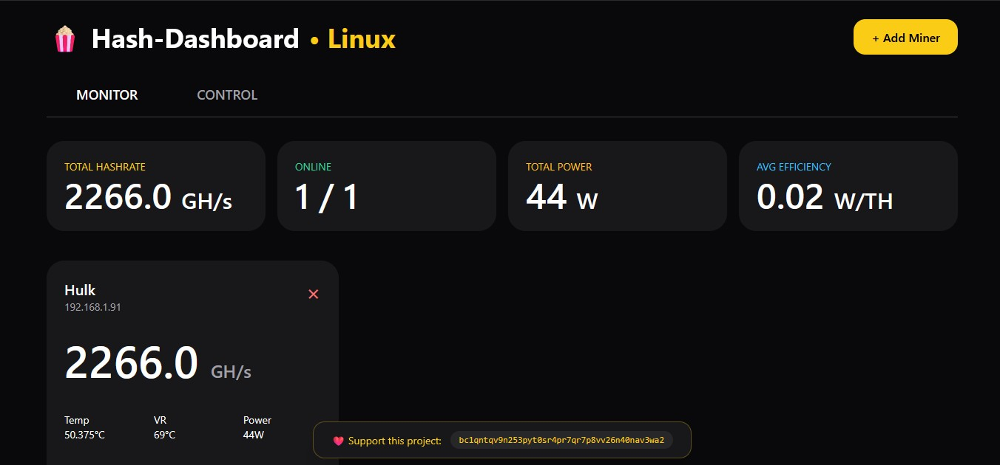

# Hash-Dashboard

A clean, local web-based dashboard for monitoring and controlling **Miners** (and other AxeOS) solo miners.

Built as a self-hosted alternative to mobile apps like HashWatcher, optimized for Linux/Umbrel users.

<p align="center">
  

## Features

- Real-time hashrate, temperature, VR temp, power, and efficiency monitoring
- Clean, modern dark UI with live charts
- Monitor + Control tabs
- Restart, Turbo Overclock, and Eco Mode controls
- Popcorn animation on load (for fun)
- Fully local — no cloud, no accounts
- Runs on port 4000 by default
- Auto-updates every 4 seconds

## Tech Stack

- Node.js + Express
- Socket.io for real-time updates
- Tailwind CSS + Chart.js
- Runs great on Umbrel, Raspberry Pi, or any Linux machine

## Installation

1. Clone the repository:
   ```bash
   git clone https://github.com/Bitdolorian/Miner-Dashboard.git
   cd Miner-Dashboard

## Install dependencies:
   npm install

## Start the dashboard:
pm2 start server.js --name hash-dashboard
pm2 save

## Open your browser and go to:
http://YOUR_LOCAL_IP:4000

## Usage
Click + Add Miner and enter your Miner's local IP address.
Switch between Monitor and Control tabs.
Use the buttons in the Control tab to restart or overclock your miner.

## Donation
If you find this project useful, consider supporting development:BTC: bc1qntqv9n253pyt0sr4pr7qr7p8vv26n40nav3wa2

## License
MIT License — feel free to fork and modify.

Made by a solo miner for the solo mining community.
